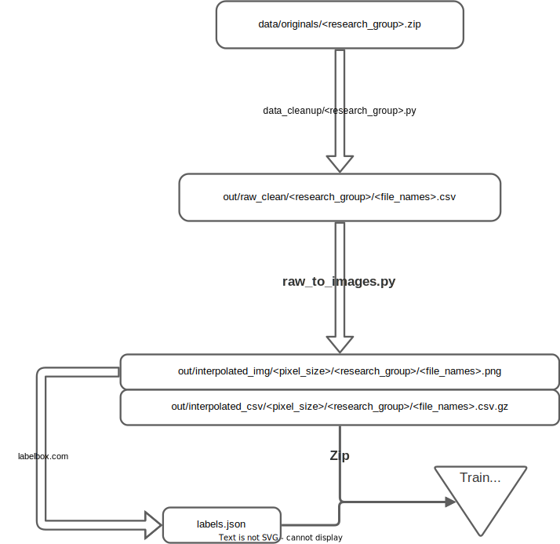

# Quantum Dots Stability Diagrams Dataset

Dataset of Quantum Dots Stability Diagrams (QDSD) for machine learning application.
This dataset is used for offline [quantum dot autotuning](https://github.com/3it-inpaqt/dot-calibration-v2).

# Download data

The experimental data should be downloaded from [QDSD](https://doi.org/10.5281/zenodo.11402792), and (at least) the
file `originals.zip` should be downloaded and unzipped in the `data` folder.

The folder is organized as follows:

* __originals.zip__ - The original data we received from experimentalists (before any processing), grouped by origins.
  No data processing was applied.
* __raw_clean.zip__ - Compressed files containing all data. Each CSV file is a stability diagram. The CSV has 3
  columns: `x, y, z`. Where `x` and `y` are the swiped gate voltages in Volt and `z` is the measured electric current in
  Amper. No data processing has been applied yet.
* __interpolated_csv.zip__ - Compressed files containing all diagrams as CSV 2D arrays. Interpolation and float rounding
  applied (data loss).
* __interpolated_images.zip__ - Compressed files containing all diagrams as PNG images. They are mainly used for
  transition line and charge area labeling. Interpolation and extreme values filter applied (data loss).
* __labels.json__ - Transition line and charge area labels (exported from [Labelbox](https://labelbox.com/))

# Data flow

# Data processing

The data processing is kept minimal to be as close as possible to the reality of experimentation.
However, in some cases, the alteration of data was necessary to be adapted to machine learning applications.

## Interpolation

To have the same constant voltage step between measurements in all stability diagrams, we interpolate the data.
The 'nearest' interpolation method is used to upscale or downscale the resolution of the `x` or `y` axes when it is
necessary.

## Filter extreme values

To visually represent the diagrams (for labeling), it was necessary to remove extreme values.
This was done by limiting the values between the 1st and the 99th percentile for each diagram.

## Rounding

In some case the voltage value is rounded to 6 decimals (microvolt).

# Processing Scripts

* __data_cleanup/__: originals => raw_clean  
  Convert the specific file structure to a standard one.
* __raw_to_images/__: raw_clean => interpolated_csv & interpolated_images  
  Interpolate data to have plottable images ready to be annotated.

# Data contribution

The original data have been provided by different research groups based on the following references:

* [Rochette et al. 2019](https://doi.org/10.1063/1.5091111) (referred as `michel_pioro_ladriere`)
* [Gaudreau et al. 2009](https://doi.org/10.1063/1.3258663) (referred as `louis_gaudreau`)
* [Stuyck et al. 2021](https://doi.org/10.23919/VLSICircuits52068.2021.9492427) (referred as `eva_dupont_ferrier`)